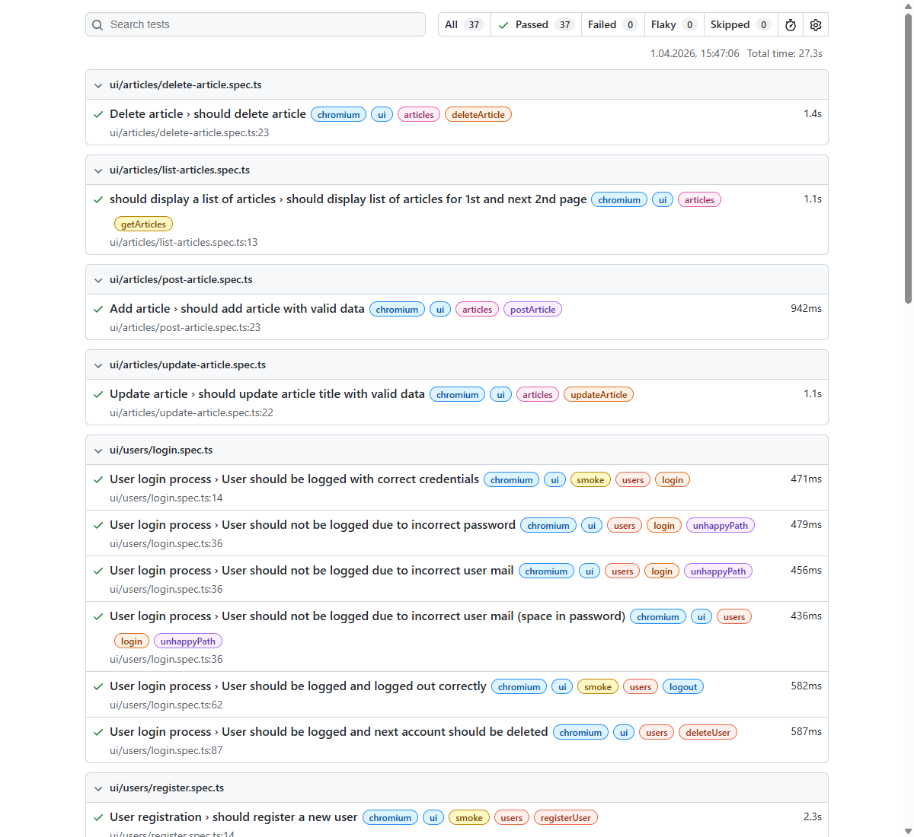

# 🎭 Playwright Automated Testing Project

Automated UI and API tests written in TypeScript with Playwright.
The suite targets a local app running at `http://localhost:3000`.

## 📚 Stack

- Playwright Test
- TypeScript
- Node.js
- dotenv
- @faker-js/faker

## 🗂️ Project Structure

```text
.
|-- .env
|-- .env.example
|-- global-setup.ts
|-- global-teardown.ts
|-- package.json
|-- playwright.config.ts
|-- README.md
|-- TESTS.md
|-- tsconfig.json
|-- assets/
|   `-- test-report.png
|-- src/
|   |-- config/
|   |   |-- api-constants.ts
|   |   |-- api-headers.ts
|   |   |-- test-tags.ts
|   |   `-- ui-constants.ts
|   |-- fixtures/
|   `-- pages/
|       |-- articles.page.ts
|       |-- login.page.ts
|       `-- register.page.ts
|-- test-results/
`-- tests/
    |-- api/
    |   |-- articles/
    |   |   |-- get-articles.spec.ts
    |   |   |-- post-article.spec.ts
    |   |   `-- test-data/
    |   |       `-- article.data.ts
    |   |-- token/
    |   |   `-- token.spec.ts
    |   `-- users/
    |       |-- delete-user.spec.ts
    |       |-- get-users.spec.ts
    |       |-- patch-user.spec.ts
    |       |-- post-user.spec.ts
    |       |-- put-user.spec.ts
    |       `-- test-data/
    |           `-- user.data.ts
    `-- ui/
        |-- articles/
        |   |-- delete-article.spec.ts
        |   |-- list-articles.spec.ts
        |   |-- post-article.spec.ts
        |   |-- update-article.spec.ts
        |   `-- test-data/
        |       `-- articles.data.ts
        `-- users/
            |-- login.spec.ts
            |-- register.spec.ts
            `-- test-data/
                |-- login.data.ts
                `-- register.data.ts
```

## ✅ Prerequisites

- Node.js LTS
- npm
- Playwright browsers installed
- tested application running at `http://localhost:3000`

## 📦 Installation

```bash
npm install
```

## 🔐 Environment Variables

Create `.env` based on `.env.example`:

```bash
# UI credentials
LOGIN_EMAIL=your-email@example.com
LOGIN_PASSWORD=your-password

# API auth credentials
TEST_USER_EMAIL=test-user@example.com
TEST_USER_PASSWORD=test-password

# populated automatically in global setup
BEARER_TOKEN=
```

## ⏳ Test Lifecycle

- `global-setup.ts`
  - logs in via `/api/login`
  - stores `BEARER_TOKEN` in `.env`
- tests run (UI + API projects)
- `global-teardown.ts`
  - restores database state via `/api/restoreDB`
  - tries `POST`, then falls back to `GET` for compatibility

## ▶️ Running Tests

Basic commands:

```bash
# Run all tests
npm test

# Run in headed mode
npm run test:headed

# Run API tests only
npx playwright test tests/api --project=api

# Run UI tests only
npx playwright test tests/ui --project=chromium
```

Configuration summary:

- `baseURL`: `http://localhost:3000`
- reporter: `html`
- trace: `on-first-retry`
- projects: `chromium`, `api`
- `workers: 1`

For the full command reference, scenarios, and targeted test runs, see [Test Suite Documentation](TESTS.md).

## Tested Application

- repo: `https://github.com/jaktestowac/gad-gui-api-demo`
- local URL: `http://localhost:3000`

## 📊 Test Report


